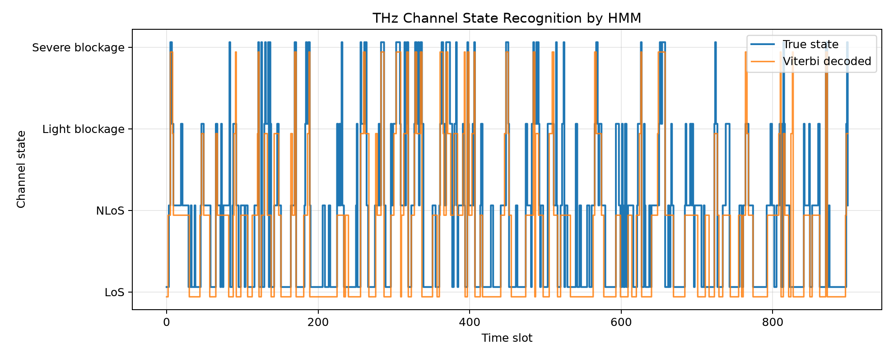
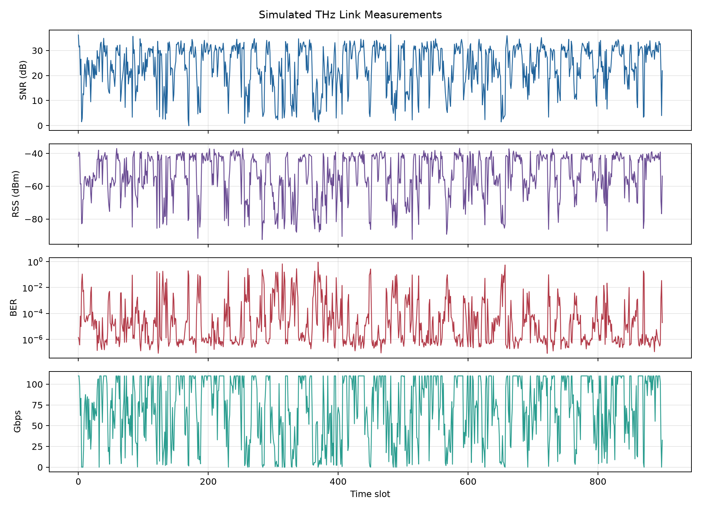
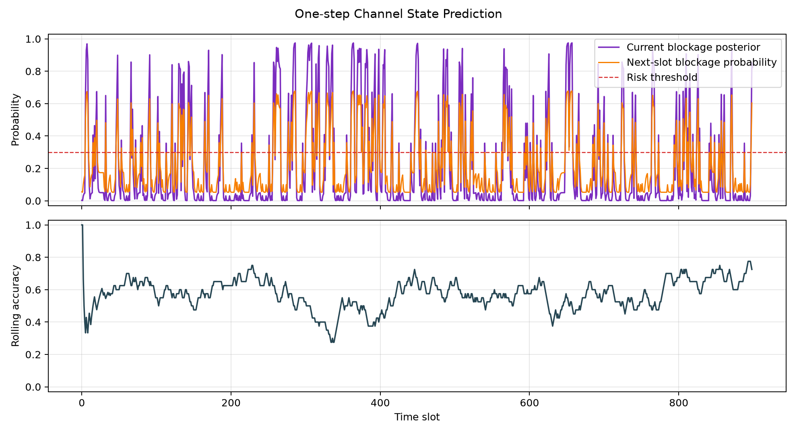
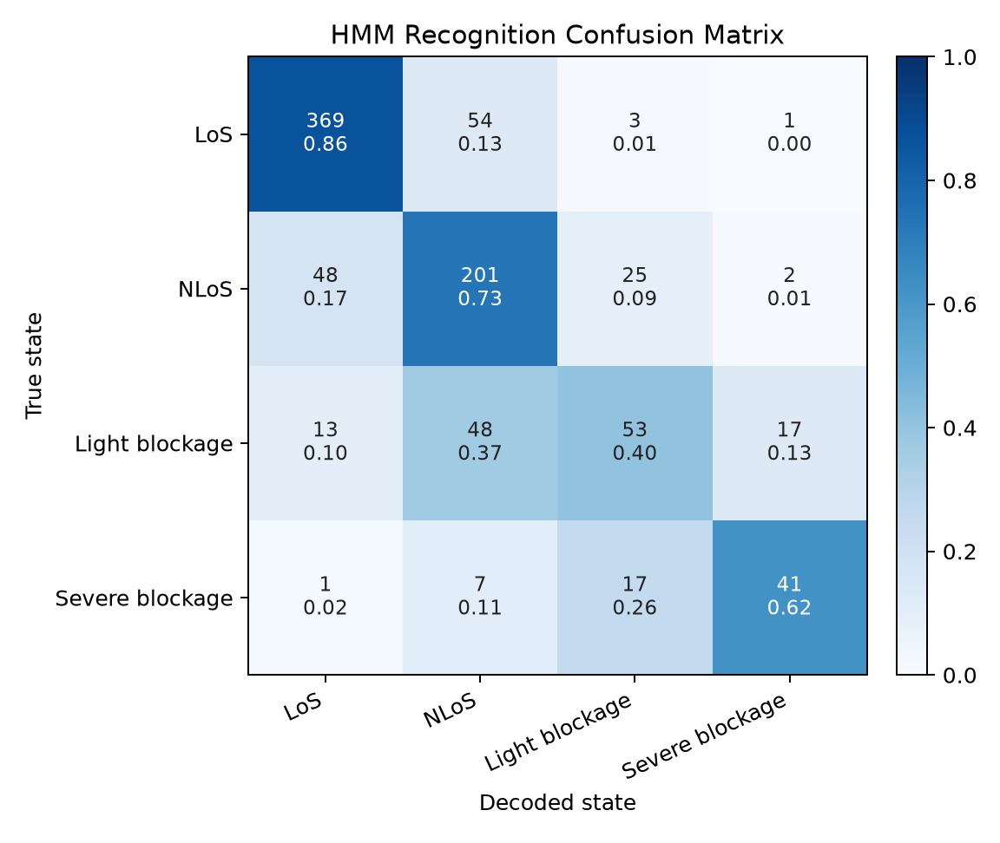

# THz HMM Channel State Prediction

基于隐马尔可夫模型（Hidden Markov Model, HMM）的太赫兹信道状态识别与一步预测仿真项目。项目面向随机过程课程报告“基于隐马尔可夫模型的太赫兹信道状态识别与预测研究”，通过可复现实验模拟太赫兹链路在
LoS、NLoS、轻度遮挡和严重遮挡之间的随机转移，并利用 Viterbi 解码、前向滤波和遮挡风险阈值实现信道状态识别与预警。

## Project Overview

太赫兹通信具有高频谱资源、大带宽和窄波束等特点，但链路容易受到分子吸收、路径损耗、遮挡和波束偏移影响。真实信道状态通常无法直接观测，只能通过
SNR、RSS、BER、吞吐量等链路质量指标间接判断。

本项目将太赫兹信道状态建模为隐藏马尔可夫链，将接收端链路质量离散为观测符号：

- Hidden states: `LoS`, `NLoS`, `Light blockage`, `Severe blockage`
- Observations: `Excellent`, `Good`, `Weak`, `Outage`
- Algorithms: Viterbi decoding, forward filtering, one-step prediction
- Outputs: recognition results, risk warning results, metrics, CSV data, plots

## Repository Structure

```text
.
├── README.md
├── .gitignore
├── docs/
├── thz_hmm_channel_state_prediction.py
├── thz_hmm_timeseries.csv
├── thz_hmm_summary.txt
├── thz_hmm_state_recognition.png
├── thz_hmm_observations.png
├── thz_hmm_prediction_risk.png
└── thz_hmm_confusion_matrix.png
```

## Core Model

HMM 参数定义为：

```text
lambda = (A, B, pi)
```

其中：

- `pi`: 初始状态分布
- `A`: 隐藏状态转移矩阵
- `B`: 观测概率矩阵

本项目使用的状态转移矩阵为：

```text
[[0.86, 0.09, 0.04, 0.01],
 [0.18, 0.66, 0.12, 0.04],
 [0.10, 0.24, 0.52, 0.14],
 [0.18, 0.12, 0.28, 0.42]]
```

观测概率矩阵为：

```text
[[0.780, 0.180, 0.035, 0.005],
 [0.120, 0.620, 0.210, 0.050],
 [0.020, 0.150, 0.620, 0.210],
 [0.005, 0.040, 0.180, 0.775]]
```

## Method

整体流程如下：

1. 根据初始状态分布生成第一个隐藏信道状态。
2. 根据状态转移矩阵生成后续隐藏状态序列。
3. 根据观测概率矩阵生成离散观测序列。
4. 进一步模拟 SNR、RSS、BER 和吞吐量等连续链路指标。
5. 使用 Viterbi 算法识别最可能的隐藏状态路径。
6. 使用前向滤波计算当前状态后验概率。
7. 根据状态转移矩阵预测下一时刻状态分布。
8. 将轻度遮挡和严重遮挡概率相加，得到遮挡风险概率。
9. 根据风险阈值输出预警结果。

## Requirements

Python 3.9+ is recommended.

Required packages:

```bash
pip install numpy matplotlib
```

The implementation does not depend on third-party HMM libraries. Viterbi decoding and forward filtering are implemented
directly for readability and course-report explanation.

## Usage

Run the simulation:

```bash
python thz_hmm_channel_state_prediction.py
```

After running, the script generates CSV data, summary metrics and figures.

## Main Results

Representative metrics from one simulation run:

```text
recognition_accuracy: 0.7378
prediction_accuracy: 0.5784
risk_warning_accuracy: 0.7909
risk_warning_precision: 0.5190
risk_warning_recall: 0.6244
risk_warning_false_alarm_rate: 0.1624
severe_blockage_recognition_accuracy: 0.6212
```

The results show that HMM can recover the main temporal trend of THz channel states and provide useful blockage risk
warnings from noisy observations.

## Figures

### State Recognition



### Continuous Observations



### Prediction and Blockage Risk



### Confusion Matrix




## Output Files

| File                                  | Description                                |
|---------------------------------------|--------------------------------------------|
| `thz_hmm_channel_state_prediction.py` | Main simulation and modeling code          |
| `thz_hmm_timeseries.csv`              | Time-series simulation data                |
| `thz_hmm_summary.txt`                 | Summary metrics and model parameters       |
| `thz_hmm_state_recognition.png`       | True states vs Viterbi decoded states      |
| `thz_hmm_observations.png`            | SNR, RSS, BER and throughput curves        |
| `thz_hmm_prediction_risk.png`         | One-step prediction and blockage risk      |
| `thz_hmm_confusion_matrix.png`        | State recognition confusion matrix         |
| `thz_hmm_length_seed_experiment.csv`  | Multi-seed sequence length experiment data |
| `thz_hmm_threshold_sweep.csv`         | Blockage risk threshold sensitivity data   |
